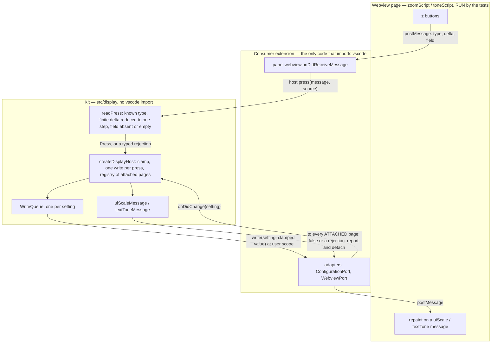
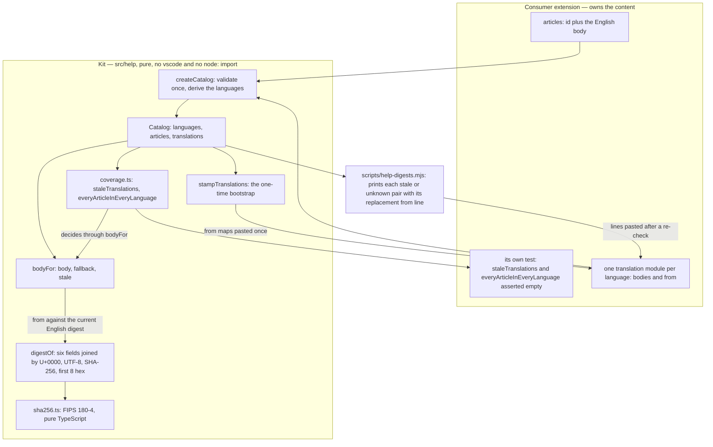

# Architecture — dew_flow_vscode_kit

> Being built along [../todo/PLAN_extract_the_kit.md](../todo/PLAN_extract_the_kit.md): epic 1 (the
> machinery and the pure modules), E2.S1 (the display host) and E2.S2 (the help catalog, its digest and
> coverage checks) have landed; the help page and panel (E2.S3) and the release pipeline (epic 3) have
> not. This file describes what exists and is rewritten as each module lands.

## What this package is

`@oleksandrdubyna88/vscode-webview-kit`: the webview building blocks two VS Code extensions share instead
of copying. Pure modules render strings from values and are tested as functions; page scripts are
strings a webview runs and are tested by RUNNING them; the few host modules take a narrow port instead
of the `vscode` namespace and are tested with a fake stricter than the real API. Nothing in `src/`
imports `vscode` — `src/test/architecture.test.ts` fails the build if a pure module does, and the only
`node:` import outside the tests is `src/webview/nonce.ts` (`node:crypto`).

## Module map

| Module | Files | Status |
|---|---|---|
| `text` | `asText.ts` | landed (E1.S2) |
| `webview` | `escape.ts` (`escapeHtml`, `escapeHtmlForHighlighting`, `jsonForScript`), `nonce.ts`, `writeQueue.ts` | landed (E1.S2) |
| `settings` | `settingWritten.ts` — the "a view setting could not be saved" reporter, consumer funnel injected | landed (E1.S2) |
| `display` — pure halves | `config.ts` (`createDisplayConfig`, prefix validation), `zoom.ts`, `tone.ts`, `messages.ts` | landed (E1.S3; `messages.ts` E2.S1) |
| `display` — host | `port.ts` (`ConfigurationPort`, `WebviewPort`), `press.ts` (`readPress`), `host.ts` (`createDisplayHost`) | landed (E2.S1) |
| `help` — catalog | `types.ts`, `sha256.ts`, `digest.ts` (`digestOf`), `catalog.ts` (`createCatalog`, `bodyFor`), `bootstrap.ts` (`stampTranslations`), `coverage.ts` (`staleTranslations`, `everyArticleInEveryLanguage`) | landed (E2.S2) |
| `help` — page, panel | `page.ts`, `panel.ts` | not built (E2.S3) |
| package entry | `src/index.ts` — exports `display`, `settings` and the help catalog; `text`, `webview` and the help page and panel follow in E2.S3 | partial |

## The display module

Two controls every page carries — ± text size (`uiScale`) and ± text tone (`textTone`) — each a GLOBAL
setting so a vision preference follows the person to their next machine. The page reports which way a
button was pressed and never the result; the host clamps, writes once, and the setting's change event
repaints every open page from the one stored value. Two open pages never show two sizes, because there is
no per-page state to disagree.

**The trust boundary** is `press.ts`. A message is read as own properties only; it must carry `type`
`zoom` or `tone`, a `delta` that is a finite number (truncated, then one step in its direction — below a
whole step is no press and no write), and a `field` that is absent or `''`. Everything else comes back as
`{ accepted: false, reason }` — `not-an-object`, `unknown-type`, `delta-not-a-number`, `no-step`, `field`
— and `readPress` never throws. ConnectOtherAIs at `1056aed9` had this rule in three parsers that
disagreed on a sub-step delta; the kit keeps the unified one (`textControlFrom`).

**The ports** (`port.ts`) are the subset of `vscode` the two coai host modules used, shaped so a consumer's
adapter is a few lines: `ConfigurationPort` reads a setting raw, writes it to the user scope (a
`PromiseLike`, so `WorkspaceConfiguration.update`'s thenable passes straight through) and watches it;
`WebviewPort` posts a `DisplayMessage` and exposes the PANEL's dispose event, which a `vscode.Webview`
itself does not carry.

**The host** (`host.ts`, finding 1 of the epic 2 plan round) keeps a registry: `attach(webview)` pushes both
current values at once, returns a disposable, and is also undone by the page's dispose event; a change
pushes only the changed setting's message, to attached pages only; a `postMessage` that resolves `false`
or rejects is caught, reported through `DisplayReporter.pushNotDelivered`, and detaches that page; a push
never runs inside the write queue, so a page that never answers cannot block a write. A failed write is
reported once through `settingWritten` with the consumer's `settingNotSaved` funnel. `dispose()` unhooks
both setting listeners and every page; `attach` after it throws.

**Byte-compatibility.** For coai's configuration (`ConnectOtherAIs`, prefix `coai`, section `coai`) the
markup, scripts, CSS, pushed messages and written values equal what coai's own modules produced at
`1056aed9`. The expected values are RECORDED from those modules by `scripts/record-coai-display.mjs` —
the host halves through a typed `vscode` stub — into `src/test/fixtures/coai-display-1056aed9.json`,
never retyped.

**Growth** (plan §5): one write queue per setting, as long as the presses not yet written; one attachment
per open page, each leaving on dispose, detach or a failed push. No files, no caches.

## The help module — the catalog half (E2.S2)

The help page reads one catalog: the consumer's articles (English, in index order) and one translation
module per language. `createCatalog` checks that input once; `bodyFor(catalog, article, language)` answers
`{ body, fallback, stale }`. The page and the panel that render it are E2.S3.

**`body` and `fallback` are coai's.** For an article in English, the English body; in another language,
that module's own body, or English with `fallback: true` when it has none. The answers are held against
ConnectOtherAIs' own `bodyFor`, RECORDED by `scripts/record-coai-help.mjs` from coai's `helpContent.ts` at
`1056aed9` — over small partial translation modules written by the recorder, and over coai's real id
coverage (33 articles, four modules) — into `src/test/fixtures/coai-help-1056aed9.json`. One deviation, with
the evidence in the recording: coai looked a body up through the prototype, so an article whose id is a
key of `Object.prototype` (`constructor`) got the Object function back as its "translation"; the kit reads
own properties only and answers the English fallback.

**`stale` is the kit's.** Each translation module is `{ bodies, from }`: `from` maps an article id to the
digest of the English body it was translated from. `fresh` when that equals the current English digest
(and always for English itself and for a fallback, which ARE the current English), `stale` when it
differs, `unknown` when the module records no `from` for a body it has — never assumed fresh.

**The digest** (`digest.ts`, plan §2): the six fields in the fixed order `title`, `whatItIs`, `why`,
`setup`, `usage`, `whatCanGoWrong`, joined with U+0000, UTF-8, no other normalisation — a CR, a trailing
space, a decomposed accent are each an edit of the English — then the first 8 hex characters of SHA-256.
32 bits is a change detector, never an integrity check.

**Why SHA-256 is pure TypeScript here and not `node:crypto`.** `bodyFor` is on the path of the PURE page
module (E2.S3 renders the stale note from it), and `architecture.test.ts` scans each file for `vscode` /
`node:` imports — a host-only `digest.ts` would have made `catalog.ts`, and through it the page, host-bound
by import while every per-file scan stayed green. Web Crypto's `subtle.digest` is asynchronous and would
make `bodyFor` a promise. So `sha256.ts` is a plain FIPS 180-4 implementation (~100 lines), used for change
detection only, pinned by the standard's five vectors and a differential run against `node:crypto` over
every length 0–200 and 300 seeded random strings (lone surrogates included). The host allowlist did not
grow: the only `node:` import outside the tests is still `src/webview/nonce.ts`.

**The boundary.** `createCatalog` refuses, with a `TypeError` naming what, where and what would be
accepted: no articles; an empty or repeated id; a body missing any of the six fields (English or
translated); a module for a language the help does not have (or for `en`); a translated body for an article
the catalog does not have; a `from` entry with no body beside it; a `from` that is not 8 lowercase hex. The
languages are derived — English, then each language with a module, in `HELP_LANGUAGES` order. Input is
never written; the catalog is a new, frozen object.

**What a consumer's CI asserts** (epic 2 plan round, finding 0). `staleTranslations(catalog)` lists every
translated body that is `stale` or `unknown` as `{ article, language, stale, from, current }` (`from` is
`null` when unknown), in article then language order; a consumer asserts it empty, so an English edit
committed without its translations fails that consumer's build rather than reaching a reader.
`everyArticleInEveryLanguage(catalog)` is coai's "every article exists in every language" check, as
`{ complete, missing }`. Both decide through `bodyFor`, so neither can disagree with what a reader sees.

**The bootstrap and the script.** `stampTranslations(catalog)` returns new modules with every body's `from`
stamped to today's English digest — run ONCE at a consumer's switch, on the stated assumption that its
shipped translations match today's English, and the result pasted into its modules; run on every build it
would switch stale detection off. After a deliberate re-translation, `scripts/help-digests.mjs <compiled
catalog module> [--export name] [--kit entry]` re-makes the catalog with the kit's own `createCatalog`,
prints exactly `staleTranslations`' pairs grouped by language with the replacement `from` line for each,
and exits 1 (0 when nothing is stale, 2 on a usage, load or validation error). It is in this repository
only for now: `package.json` `files` is still `["dist"]`, so shipping it to consumers is open (E2.S3 or E3).

**Growth:** none. The catalog is made once from the consumer's constants; nothing is cached or kept.

## The test harness

See [module_tests.md](module_tests.md): the page-script sandbox, the strict display fakes, the flow
catalogue, and what the suite does not prove.

## Repository machinery

- `package.json` (`@oleksandrdubyna88/vscode-webview-kit` 0.1.0, CommonJS, `main`/`types`/`exports` into
  `dist/`, `files: ["dist"]`, no `dependencies`), `tsconfig.json` (coai's strict set, ES2022 without DOM,
  `noEmitOnError`), `tsconfig.build.json` (declarations into `dist/`, tests excluded), `eslint.config.mjs`
  (type-aware, `complexity 4` / `max-lines-per-function 50` on `src/**`, `linebreak-style unix`),
  `scripts/run-tests.mjs` (readdir discovery, `node --test`), `scripts/clean.mjs`, the two coai
  recorders `scripts/record-coai-display.mjs` and `scripts/record-coai-help.mjs` over their shared
  `scripts/coai-modules.mjs` (extract coai sources at a ref, compile them, load them), and
  `scripts/help-digests.mjs`.
- **CI:** `.github/workflows/ci.yml` runs the whole chain — conventions check, plan lifecycle, typecheck,
  lint, test, build, `npm pack --dry-run` — on `ubuntu-latest` AND `windows-latest`, every action pinned to a
  commit SHA; `pr-title.yml`, `coderabbit-review.yml` + `.coderabbit.yaml`, `dependabot.yml`.
- The family rules, mounted at `.agents/conventions` (tracking `release`), and the Claude host adapter
  (`.claude/settings.json`, `.claude/hooks/`).

## Consumers (cross-repository)

| Repository | Uses | Since |
|---|---|---|
| `dew_flow_connect_other_ais` | the source of the extracted modules (`src_vs_code/src` at `1056aed9`); switches to the package in its own PR, adapting `vscode.workspace` and each panel to the two ports | planned |
| `wsl_care` | the help page and display controls of its extension | planned |
