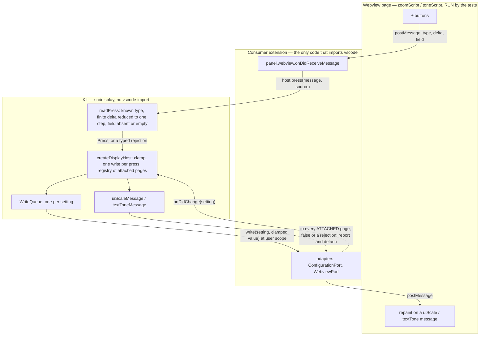

# Architecture — dew_flow_vscode_kit

> Being built along [../todo/PLAN_extract_the_kit.md](../todo/PLAN_extract_the_kit.md): epic 1 (the
> machinery and the pure modules) and E2.S1 (the display host) have landed; the help subsystem
> (E2.S2, E2.S3) and the release pipeline (epic 3) have not. This file describes what exists and is
> rewritten as each module lands.

## What this package is

`@oleksandrdubyna88/vscode-webview-kit`: the webview building blocks two VS Code extensions share instead
of copying. Pure modules render strings from values and are tested as functions; page scripts are
strings a webview runs and are tested by RUNNING them; the few host modules take a narrow port instead
of the `vscode` namespace and are tested with a fake stricter than the real API. Nothing in `src/`
imports `vscode` — `src/test/architecture.test.ts` fails the build if a pure module does, and the only
`node:` import outside the tests is `src/webview/nonce.ts` (`node:crypto`).

## Module map

| Module | Files | Status |
|---|---|---|
| `text` | `asText.ts` | landed (E1.S2) |
| `webview` | `escape.ts` (`escapeHtml`, `escapeHtmlForHighlighting`, `jsonForScript`), `nonce.ts`, `writeQueue.ts` | landed (E1.S2) |
| `settings` | `settingWritten.ts` — the "a view setting could not be saved" reporter, consumer funnel injected | landed (E1.S2) |
| `display` — pure halves | `config.ts` (`createDisplayConfig`, prefix validation), `zoom.ts`, `tone.ts`, `messages.ts` | landed (E1.S3; `messages.ts` E2.S1) |
| `display` — host | `port.ts` (`ConfigurationPort`, `WebviewPort`), `press.ts` (`readPress`), `host.ts` (`createDisplayHost`) | landed (E2.S1) |
| `help` | catalog, digest, page, panel | not built (E2.S2, E2.S3) |
| package entry | `src/index.ts` — exports `display` and `settings`; `text`, `webview` and `help` follow in E2.S3 | partial |

## The display module

Two controls every page carries — ± text size (`uiScale`) and ± text tone (`textTone`) — each a GLOBAL
setting so a vision preference follows the person to their next machine. The page reports which way a
button was pressed and never the result; the host clamps, writes once, and the setting's change event
repaints every open page from the one stored value. Two open pages never show two sizes, because there is
no per-page state to disagree.

**The trust boundary** is `press.ts`. A message is read as own properties only; it must carry `type`
`zoom` or `tone`, a `delta` that is a finite number (truncated, then one step in its direction — below a
whole step is no press and no write), and a `field` that is absent or `''`. Everything else comes back as
`{ accepted: false, reason }` — `not-an-object`, `unknown-type`, `delta-not-a-number`, `no-step`, `field`
— and `readPress` never throws. ConnectOtherAIs at `1056aed9` had this rule in three parsers that
disagreed on a sub-step delta; the kit keeps the unified one (`textControlFrom`).

**The ports** (`port.ts`) are the subset of `vscode` the two coai host modules used, shaped so a consumer's
adapter is a few lines: `ConfigurationPort` reads a setting raw, writes it to the user scope (a
`PromiseLike`, so `WorkspaceConfiguration.update`'s thenable passes straight through) and watches it;
`WebviewPort` posts a `DisplayMessage` and exposes the PANEL's dispose event, which a `vscode.Webview`
itself does not carry.

**The host** (`host.ts`, finding 1 of the epic 2 plan round) keeps a registry: `attach(webview)` pushes both
current values at once, returns a disposable, and is also undone by the page's dispose event; a change
pushes only the changed setting's message, to attached pages only; a `postMessage` that resolves `false`
or rejects is caught, reported through `DisplayReporter.pushNotDelivered`, and detaches that page; a push
never runs inside the write queue, so a page that never answers cannot block a write. A failed write is
reported once through `settingWritten` with the consumer's `settingNotSaved` funnel. `dispose()` unhooks
both setting listeners and every page; `attach` after it throws.

**Byte-compatibility.** For coai's configuration (`ConnectOtherAIs`, prefix `coai`, section `coai`) the
markup, scripts, CSS, pushed messages and written values equal what coai's own modules produced at
`1056aed9`. The expected values are RECORDED from those modules by `scripts/record-coai-display.mjs` —
the host halves through a typed `vscode` stub — into `src/test/fixtures/coai-display-1056aed9.json`,
never retyped.

**Growth** (plan §5): one write queue per setting, as long as the presses not yet written; one attachment
per open page, each leaving on dispose, detach or a failed push. No files, no caches.

## The test harness

See [module_tests.md](module_tests.md): the page-script sandbox, the strict display fakes, the flow
catalogue, and what the suite does not prove.

## Repository machinery

- `package.json` (`@oleksandrdubyna88/vscode-webview-kit` 0.1.0, CommonJS, `main`/`types`/`exports` into
  `dist/`, `files: ["dist"]`, no `dependencies`), `tsconfig.json` (coai's strict set, ES2022 without DOM,
  `noEmitOnError`), `tsconfig.build.json` (declarations into `dist/`, tests excluded), `eslint.config.mjs`
  (type-aware, `complexity 4` / `max-lines-per-function 50` on `src/**`, `linebreak-style unix`),
  `scripts/run-tests.mjs` (readdir discovery, `node --test`), `scripts/clean.mjs`,
  `scripts/record-coai-display.mjs`.
- **CI:** `.github/workflows/ci.yml` runs the whole chain — conventions check, plan lifecycle, typecheck,
  lint, test, build, `npm pack --dry-run` — on `ubuntu-latest` AND `windows-latest`, every action pinned to a
  commit SHA; `pr-title.yml`, `coderabbit-review.yml` + `.coderabbit.yaml`, `dependabot.yml`.
- The family rules, mounted at `.agents/conventions` (tracking `release`), and the Claude host adapter
  (`.claude/settings.json`, `.claude/hooks/`).

## Consumers (cross-repository)

| Repository | Uses | Since |
|---|---|---|
| `dew_flow_connect_other_ais` | the source of the extracted modules (`src_vs_code/src` at `1056aed9`); switches to the package in its own PR, adapting `vscode.workspace` and each panel to the two ports | planned |
| `wsl_care` | the help page and display controls of its extension | planned |
